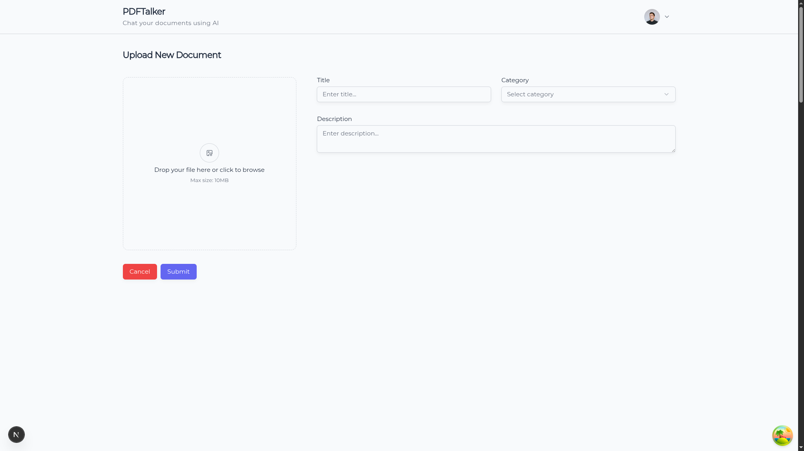
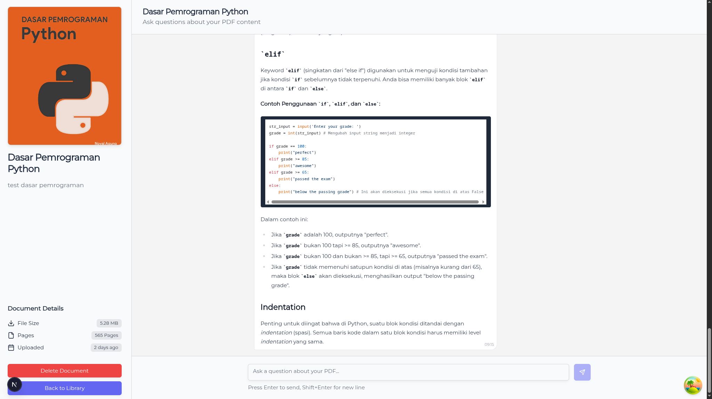
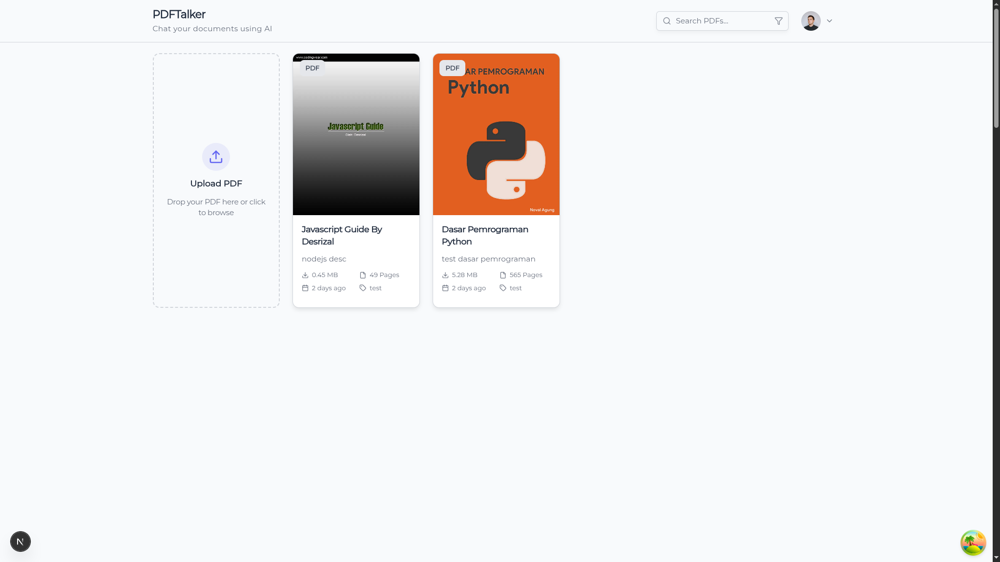

# PDFTalk

PDFTalk is a modern **Retrieval-Augmented Generation (RAG)** web application that lets you **upload, search, and chat with your PDFs**.
It combines semantic search with powerful LLMs to deliver accurate, context-aware answers directly from your documents.

## Screenshots

> Example UI previews of the app

| Upload PDF | Chat with Document |
|------------|--------------------|
|  |  |

| Homepage | Auth |
|------------|--------------------|
|  |  |

---


## Tech stack
- **Framework:** Next.js
- **RPC / API:** Hono / hono-rpc
- **Styling:** Tailwind CSS + shadcn/ui
- **Data fetching:** TanStack Query
- **Vector DB:** Pinecone
- **LLM / embeddings:** LangChain + Gemini
- **Auth:** Better Auth + Better Auth UI
- **DB:** PostgreSQL + Prisma

---

## Features
- Upload & index PDF documents (extract text + embeddings)
- Search/query PDF content using vector similarity search (Pinecone)
- RAG answers using LangChain orchestration + Gemini LLM
- Authenticated users (Better Auth)
- Responsive UI using Tailwind + shadcn components
- Client caching & background queries with TanStack Query

---

## Quickstart

### Requirements
- Node.js (v18+)
- PostgreSQL
- Pinecone account and index
- Google/Anthropic/Vertex (Gemini) API key (or any LLM provider supported by LangChain)

### Install
```bash
# install dependencies
bun install
# or
npm install
```

### Environment

Create a `.env` file with the following (example):

```bash
DATABASE_URL="postgresql://<DB_USERNAME>:<DB_PASSWORD>@<DB_HOSTNAME>:<DB_PORT>/<DB_NAME>"

BETTER_AUTH_SECRET=t0h3BmZShSgBTtQe2BOun8J5AtBiWtPU
BETTER_AUTH_URL=http://localhost:3000

NEXT_PUBLIC_API_URL=http://localhost:3000
GOOGLE_API_KEY=

PINECONE_API_KEY=
PINECONE_ENVIRONMENT=us-east-1
PINECONE_INDEX_NAME=
```

### Database

```bash
bunx prisma generate
bunx prisma migrate dev --name init
```

### Local Dev

```bash
bun run dev
# or
npm run dev
```
